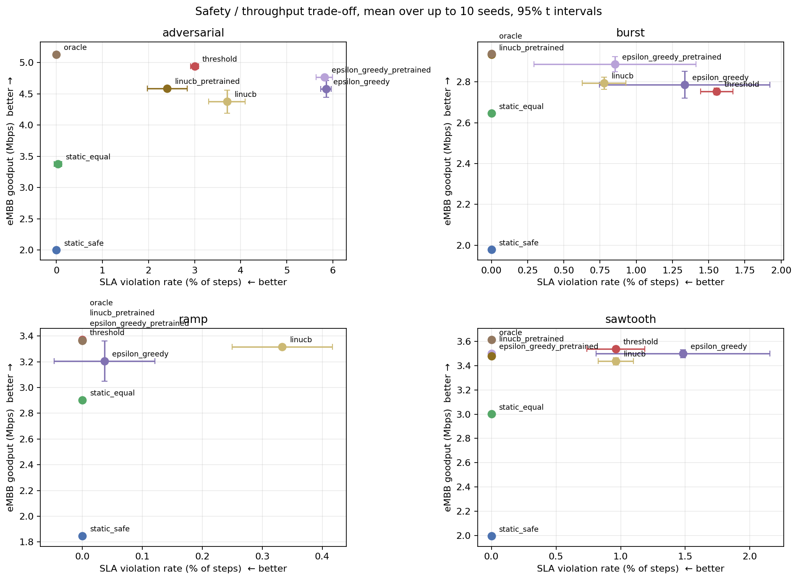
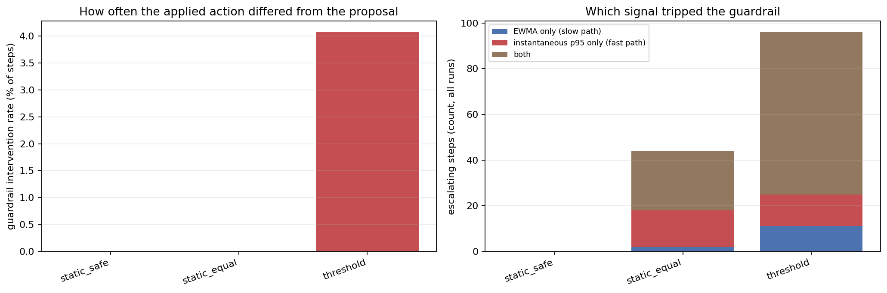
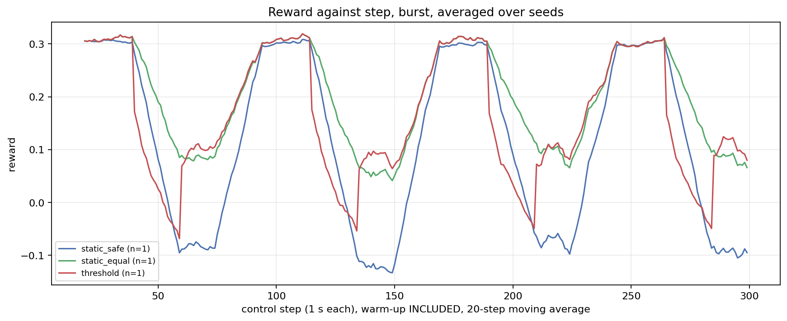

# SafeSlice: The Whole Project in Easy Words

**Safe Dynamic Network Slicing for SLA-Preserving SDN**

Prithvi Raghu (24BCE2624) · Sumanta Kumar (24BCT0302) · Guide: Sasikala R · SCOPE, VIT

> This is the plain-language version of the project, written to help us explain it to faculty.
> The full technical write-up, with every number and confidence interval, is in
> [`docs/REPORT.md`](REPORT.md). Every number below comes from code in this repository that
> actually ran, and it can be reproduced with the commands in section 13.

---

## Contents

1. [The project in one minute](#1-the-project-in-one-minute)
2. [The problem, explained with a road analogy](#2-the-problem-explained-with-a-road-analogy)
3. [Words you need to know](#3-words-you-need-to-know)
4. [Our idea: a small learner plus a safety guard](#4-our-idea-a-small-learner-plus-a-safety-guard)
5. [How the system works, step by step](#5-how-the-system-works-step-by-step)
6. [What we actually built](#6-what-we-actually-built)
7. [The four traffic tests](#7-the-four-traffic-tests)
8. [Who we competed against](#8-who-we-competed-against)
9. [How we made the tests fair](#9-how-we-made-the-tests-fair)
10. [What we found](#10-what-we-found)
11. [What we could not do](#11-what-we-could-not-do)
12. [Our journey, week by week](#12-our-journey-week-by-week)
13. [How to run it (demo)](#13-how-to-run-it-demo)
14. [Questions faculty might ask, with answers](#14-questions-faculty-might-ask-with-answers)
15. [Conclusion](#15-conclusion)

---

## 1. The project in one minute

Modern networks (such as 5G) carry very different kinds of traffic over the same wire. Some
traffic needs to be **fast** (low delay), and some needs to be **big** (lots of data). If you
split the bandwidth once and never change it, you either waste capacity or you let the urgent
traffic get stuck behind the big traffic.

**Our project builds a small "smart controller" that changes how the bandwidth is split every
second.** It learns from what happens on the network (a method called a *contextual bandit*,
using an algorithm called **LinUCB**). We placed a **safety guard** (the *guardrail*) between it
and the network. The guard follows fixed rules and blocks risky decisions, so safety does not
depend on the learner being right.

We tested it on a **network simulator** that we wrote in Python. We used 4 traffic patterns
and 10 random seeds, which gave 320 main test runs and about 1,500 runs in total.

**Main result, in one sentence:** when the learner is trained beforehand, it beats a well-tuned
hand-written rule on 3 of 4 traffic patterns *and* causes fewer delay violations. When it has to
learn "live" from scratch, it loses on 3 of 4, because trying things out (exploration) has a
cost.

---

## 2. The problem, explained with a road analogy

Think of the network link as a **road with a fixed width** (10 Mbps in our project). Three kinds
of vehicles share it:

| Vehicle | Network name | What it needs | Real example |
|---|---|---|---|
| Ambulance | **URLLC** (Ultra-Reliable Low-Latency) | Must arrive **fast**, every time | Remote surgery, factory robots, self-driving alerts |
| Big trucks | **eMBB** (enhanced Mobile Broadband) | Wants **as much road as possible** | Video streaming, big downloads |
| Normal cars | **Best Effort (BE)** | Should get *some* road, but no promise | Web browsing, email |

**Option A: split the road once and never change it (static slicing).**
- If you reserve a wide lane for ambulances "just in case", that lane is empty most of the time
  and wasted.
- If you reserve a narrow lane, then on a busy day the trucks spill over and the ambulance gets
  stuck. That is an **SLA violation**, meaning we broke our promise about delay.

**Option B: change the split as traffic changes (dynamic slicing).** This is better, but
*who decides*, and *how do we make sure they never make a dangerous choice*?

Many research papers use **Deep Reinforcement Learning (DRL)** for this. DRL is heavy: it takes a
long time to train, needs a lot of computing power, and gives **no safety promise while it is
still learning**. We asked whether something lighter, plus a proper safety guard, could do
the job.

**Our research question:**
> Can a lightweight learner plus a deterministic safety mechanism beat a well-tuned rule-based
> controller, and what exactly does the safety mechanism guarantee?

---

## 3. Words you need to know

| Term | Simple meaning |
|---|---|
| **SDN** (Software-Defined Networking) | The network is controlled by software from one central place, not configured box by box. |
| **Network slicing** | Cutting one physical network into several "virtual" networks (slices), each with its own rules. |
| **Latency / RTT** | How long a packet takes to make the trip. Lower is better. Measured in milliseconds (ms). |
| **p95 latency** | The delay that 95 % of packets beat. It tells you about the *slow* packets, not the average ones. |
| **SLA** (Service Level Agreement) | A promise, for example "URLLC delay stays under 7 ms". Breaking it is a **violation**. |
| **Throughput / goodput** | How much useful data actually got through (Mbps). Higher is better. |
| **Token bucket** | The standard way a network switch limits how fast a queue can send. We simulate it. |
| **Multi-armed bandit** | A learning method named after slot machines ("one-armed bandits"). You have several machines (choices), you do not know which pays best, and you learn by trying them. |
| **Contextual bandit** | A bandit that also looks at the current situation (the *context*) before choosing. For example, "it's rush hour, so pick differently". |
| **LinUCB** | A popular contextual-bandit algorithm. It estimates how good each choice is and adds a bonus for choices it is still unsure about, which encourages it to explore them. |
| **Exploration vs. exploitation** | Trying new options to learn (explore) versus using the best-known option (exploit). Exploring costs something in the short term. |
| **Reward** | A single score after each decision: good for throughput, bad for delay violations. The learner tries to maximise it. |
| **Guardrail** | Our fixed-rule safety guard that blocks risky choices. |
| **EWMA** | A smoothed (moving-average) value. It is stable but reacts **slowly** to sudden changes. |
| **Seed** | A number that fixes the "random" traffic, so the same seed always gives exactly the same traffic. |

---

## 4. Our idea: a small learner plus a safety guard

Our system has two parts, like a **learner driver with an instructor who has a brake pedal**.

### Part 1: The learner (contextual bandit, LinUCB)

Every second it looks at **9 measurements** of the network (the "context"):

- smoothed delay (EWMA) **and** the delay right now (instantaneous p95)
- how busy each slice is (URLLC, eMBB, BE) and how busy the whole link is
- how much URLLC traffic is waiting in its queue (backlog)
- how many packets were dropped recently
- a constant "bias" value (a technical detail of the algorithm)

Then it picks **one of 5 choices**: how much of the road to give the big trucks (eMBB).

| Choice | 1 | 2 | 3 | 4 | 5 |
|---|---|---|---|---|---|
| eMBB gets at most | 20 % | 35 % | 50 % | 65 % | 80 % |

We chose **fixed levels** ("give eMBB 50 %") instead of **up/down moves** ("increase a bit").
With up/down moves, the result of a choice depends on where you started, and a bandit is not
designed for that kind of problem. With fixed levels, each choice means the same thing every time.

### Part 2: The safety guard (guardrail)

The guard sits **between** the learner and the network, so every decision passes through it. It
follows three simple rules, checked in this order:

1. **Cool-down (hold-down):** after an emergency, keep eMBB at the safest level for 3 seconds so
   the controller does not swing straight back.
2. **Emergency brake (hard override):** if URLLC delay goes above **7 ms**, force eMBB down to
   the safest level (20 %).
3. **Caution zone (warn mask):** if delay is above **4 ms**, forbid the aggressive levels
   (65 % and 80 %).

Two details make the guard well designed:

- **It asks, it doesn't just overrule.** If the learner picks something forbidden, the guard
  asks it to pick again *from the safe options*. That way, whatever the learner knows about
  which safe option is best is still used.
- **It watches both the slow signal and the fast signal.** The emergency brake fires if
  *either* the smoothed delay *or* the delay right now is too high. We argued at the start that
  the slow signal alone would react too late, and the results later showed we were right
  (section 10).

### The score (reward)

After each second, the system gets a score:

```
score = (reward for eMBB data delivered)
      + (small reward for Best Effort data delivered)
      − (penalty for how far delay went over the 5 ms target)
      − (big penalty if delay crossed the 7 ms hard limit)
      − (penalty for dropped packets)
```

In simple words: **carry as much data as you can, but you lose points for making the urgent
traffic late.** The score only looks at what happened on the network. It never sees which
policy made the decision, so no policy can "cheat" the score.

---

## 5. How the system works, step by step

This loop repeats **every 1 second** for 300 seconds per test run:

```
   ┌──────────────────────────────────────────────────────────────────┐
   │ 1. Traffic arrives (from a pre-defined, seeded traffic pattern)  │
   └──────────────────────────────┬───────────────────────────────────┘
                                  ▼
   ┌──────────────────────────────────────────────────────────────────┐
   │ 2. Simulator runs the 3 queues on the 10 Mbps link for 1 second  │
   │    (in small 10 ms steps, using token buckets)                   │
   └──────────────────────────────┬───────────────────────────────────┘
                                  ▼
   ┌──────────────────────────────────────────────────────────────────┐
   │ 3. Measurements come out: delay, throughput, drops, backlog      │
   │    → turned into the 9-number "context"                          │
   │    → turned into a score (reward) for the previous decision      │
   └──────────────────────────────┬───────────────────────────────────┘
                                  ▼
   ┌──────────────────────────────────────────────────────────────────┐
   │ 4. Learner (LinUCB) updates what it knows, then PROPOSES a level │
   └──────────────────────────────┬───────────────────────────────────┘
                                  ▼
   ┌──────────────────────────────────────────────────────────────────┐
   │ 5. Guardrail checks it: allowed? If not, learner re-picks from   │
   │    the safe options. Final answer is always inside the safe set. │
   └──────────────────────────────┬───────────────────────────────────┘
                                  ▼
   ┌──────────────────────────────────────────────────────────────────┐
   │ 6. New eMBB limit is APPLIED to the network, and everything is   │
   │    logged (proposed choice, applied choice, reason)              │
   └──────────────────────────────┬───────────────────────────────────┘
                                  │
                                  └──────────► back to step 1
```

---

## 6. What we actually built

Everything is written in **Python**. The code is organised into folders, one per job:

| Folder | What's inside | Easy explanation |
|---|---|---|
| `config/` | `default.yaml` and 4 scenario files | All settings in one place: link speed, choices, limits, weights |
| `traffic/` | `traces.py` | Creates the traffic patterns, the same every time for a given seed |
| `net/` | `backend.py`, `sim_backend.py` | The **network simulator**: 3 queues, token buckets, a shared 10 Mbps link |
| `agent/` | `context.py`, `reward.py`, `guardrail.py`, `bandit.py`, `policies/` | The **brain**: the 9 measurements, the score, the safety guard, LinUCB, and all competing policies |
| `experiments/` | `run_experiment.py`, `run_suite.py`, `tune.py`, `sensitivity.py` | Scripts that run one test, all 320 tests, tuning, and the reward-weight study |
| `analysis/` | `metrics.py`, `aggregate.py`, `plots.py` | Turn raw logs into tables and graphs |
| `tests/` | 121 automated tests | Check the code is correct (all 121 pass) |
| `results/summary/` | CSV tables and figures | The final results |
| `docs/` | Plan, design, experiments, report | Written explanations |

### Design choices worth mentioning to faculty

- **Simulator, not a real switch.** The simulator behaves like the queues in Open vSwitch (a
  real software switch), using the same "token bucket" idea. This is explained honestly in
  section 11.
- **The "plug-in" design.** All the smart parts (learner, guard, metrics) talk to a general
  `NetworkBackend` interface, not to the simulator directly. A real switch could be plugged in
  later without rewriting the brain.
- **We fixed our own bugs early and wrote them down.** For example, an early version of the
  simulator made levels 50 %, 65 % and 80 % behave *identically* (the token bucket was sized
  wrongly), so the choice had no effect. We found it, fixed it, and recorded it in
  `docs/DESIGN.md` section 6.
- **We picked delay limits from measurement.** Our original slides said 15 ms / 25 ms. In our
  simulator, delay never goes above about 9 ms, so a 25 ms limit would never be crossed and the
  safety guard would never do anything. We measured the delay at each level and set the limits
  to **5 ms (target)** and **7 ms (hard limit)**:

  | eMBB level | 20 % | 35 % | 50 % | 65 % | 80 % |
  |---|---|---|---|---|---|
  | URLLC p95 delay (ms) | 2.00 | 3.39 | 5.27 | 7.16 | 9.04 |

  So "safe" is somewhere between 50 % and 65 %, and different policies really do make different
  decisions.

---

## 7. The four traffic tests

Each test ("scenario") is a repeating traffic pattern. We designed them so that each one tests
something different.

| Scenario | What happens | Why we included it |
|---|---|---|
| **Burst** | URLLC steady at 3 Mbps; eMBB alternates between quiet (2 Mbps) and heavy (10 Mbps) | The *easy* case for fixed rules. A fair, hard test for us. |
| **Ramp** | URLLC steady; eMBB slowly rises from 1 to 9 Mbps and back | Smooth change. A simple rule should do well here. |
| **Sawtooth** | URLLC switches between safe (1.5) and risky (3.0 Mbps); eMBB rises in a saw pattern that does not line up with it | No single fixed level is right. This is where context matters most. |
| **Adversarial** | Long calm periods tempt policies to give eMBB a lot, then sudden short URLLC spikes (6–8 s) | A deliberate "trap" to test the safety guard |

The adversarial scenario worked exactly as designed. **All 562 violations it produced happened
during a spike, and none happened during calm periods.**

---

## 8. Who we competed against

To show our method is actually good, we compared it with several other approaches:

| Policy | What it does | Role |
|---|---|---|
| `static_safe` | Always gives eMBB the minimum (20 %) | Very safe, wastes capacity. The **floor**. |
| `static_equal` | Always uses a roughly equal three-way split | The simple "do nothing clever" option |
| `threshold` | Rule-based: if delay is high, step eMBB down; if low, step up | **Our main competitor.** Hand-tuned, no learning. |
| `epsilon_greedy` | A bandit that **ignores the context** | Tests whether our 9 measurements actually help |
| `linucb` | **Our method**, learning live during the test | Honest "deploy and learn" number |
| `linucb_pretrained` | **Our method**, trained earlier on separate traffic, then frozen | "Train first, then deploy" number |
| `oracle` | Knows the traffic pattern in advance and picks the best fixed level per phase | A **reference line**, not a real method. It "cheats" by knowing the future. |

**Why report both LinUCB versions?** If we showed only the pre-trained one, we would hide the
cost of learning live. If we showed only the live one, we would undersell what the method does
after it has had time to learn. Showing both is the honest option.

---

## 9. How we made the tests fair

- **Same traffic for everyone.** A seed fixes the traffic exactly, so every policy faces
  identical traffic on seed 0, seed 1, and so on. We compare them **seed by seed** (a "paired"
  comparison), which is fairer and more precise.
- **10 seeds × 4 scenarios × 8 policies = 320 runs**, each 300 seconds long. We ignore the first
  30 seconds (warm-up).
- **No peeking.** Tuning and pre-training used **separate seeds** (100–104) that are never used
  for scoring (0–9). A test in the code checks that the two sets never overlap. This is like not
  letting students see the exam paper while they study.
- **Randomised order.** Runs are executed in a shuffled order, and the order is saved.
- **Everything is logged and reproducible.** Every run saves its settings, computer details and
  code version, so anyone can rerun it and get the same numbers.
- **95 % confidence intervals.** We check whether a difference is real or could just be random
  noise.

---

## 10. What we found

### Finding 1: Learning live costs too much; learning beforehand wins

Score difference compared with the `threshold` rule (positive means we did better):

| | Adversarial | Burst | Ramp | Sawtooth |
|---|---|---|---|---|
| LinUCB **learning live** | ❌ −0.073 | ✅ +0.025 | ❌ −0.022 | ❌ −0.010 |
| LinUCB **pre-trained** | ≈ tie (−0.005) | ✅ **+0.058** | ✅ +0.002 | ✅ **+0.023** |

- Learning live **loses on 3 of 4** tests, because it spends time trying bad options.
- Pre-trained **wins on 3 of 4** and ties the fourth.
- It's the **same algorithm** in both rows. The only difference is whether it was trained first,
  so the whole gap is **the cost of exploration**.
- We **predicted this in week one**, before writing any learning code, and committed in writing
  to report it honestly instead of tuning until it went away.

### Finding 2: It is not just faster, it is also safer

The pre-trained LinUCB wins **with fewer SLA violations**, so it does not win by taking more
risks. Change in violation rate compared with `threshold` (negative means fewer violations):

| | Adversarial | Burst | Ramp | Sawtooth |
|---|---|---|---|---|
| LinUCB pre-trained | −0.59 % | −1.56 % | 0.00 % | −0.96 % |

The clearest example, from the reward-weight study (Finding 6): pre-trained LinUCB moved
**3.634 Mbps with 0.70 % violations**, while `threshold` moved **3.655 Mbps with 1.54 %
violations**. That is almost the same data (within 0.6 %) with **less than half the
violations**.



*How to read this graph: up means more data, left means fewer violations, so **top-left is
best**. Pre-trained LinUCB sits near the top-left, close to the "cheating" oracle.*

### Finding 3: The 9 measurements (context) really help

In the adversarial "trap" test, here is how often each policy got caught during a spike:

| Policy | Caught during spikes |
|---|---|
| Bandit **without** context (`epsilon_greedy`) | 30.4 % |
| LinUCB learning live | 19.2 % |
| `threshold` rule | 15.6 % |
| **LinUCB pre-trained** | **12.5 %** |

The bandit that ignores the context was caught **more than twice as often** as our pre-trained
one on exactly the same traffic. The only difference between them is whether they look at the
context, so **the context carries real warning signs**. (The static policies were rarely or never
caught, but only because they never give eMBB much bandwidth in the first place.)

### Finding 4: The safety guard helps, but it is not magic

- The guard is active and changes up to **51.6 %** of decisions for the most aggressive policy.
- **But it does NOT prevent every violation.** It reacts to what happened in the *previous*
  second, so it cannot stop the *first* second of a sudden spike it has not seen yet. It can only
  stop the second and later ones.
- What it **does guarantee** (and we proved this with 5,000 random tests against a "bad" policy
  that always asks for the most dangerous option): **the final decision is always inside the
  allowed safe set.** It limits the *choices*, but it cannot promise *zero violations*.

We report this limitation openly because saying "the guard makes it 100 % safe" would be false.

### Finding 5: Watching the "right now" delay was the right call

Across all 320 runs, when the guard escalated, this is which signal triggered it:

| Signal that triggered | Share |
|---|---|
| Smoothed delay only (slow) | 4.8 % |
| **Right-now delay only (fast)** | **38.3 %** |
| Both | 56.9 % |

A guard that only watched the smoothed signal would have **missed more than 1 in 3
emergencies**. We argued this in the design stage before we had any data, and the data confirmed
it.



### Finding 6: The result holds when we change the scoring weights

The score formula uses weights we chose ourselves (how much delay matters compared with
throughput). A fair question is whether we picked weights that happen to favour our method. So we
ran **900 more tests** with 15 different weight combinations.

- Pre-trained LinUCB came **1st in all 15** combinations, and the lead was statistically clear in
  **13 of 15**. The 2 unclear cases had the weakest delay penalty, where safety matters least.
- The **2nd place** did change with the weights. So we can't say "X is the second-best
  approach", but the winner stays the same.
- **Only the learning policies adapt to the weights.** When we made delay 16× more important,
  pre-trained LinUCB automatically cut violations from 0.70 % to **0.37 %** with no manual
  changes. The `threshold` rule and static policies did not change at all, because they are
  fixed rules that never look at the score.

### Finding 7: It is lightweight

| Policy | Time per decision (average) |
|---|---|
| Static | ~0.02 ms |
| Threshold rule | ~0.04 ms |
| LinUCB | **~0.09 ms** (under 0.25 ms even in the worst 1 %) |

We make one decision per **second** (1,000 ms), so LinUCB uses less than 0.03 % of the time
available. That is thousands of times cheaper than the control interval, which supports calling
the method "lightweight". (These timings are rough, because the computer was under memory
pressure. The other results don't depend on timing.)

### A picture of learning over time



*Each dip is a burst of heavy eMBB traffic. In the first burst, live-learning LinUCB (yellow)
and the context-free bandit fall the furthest because they are still exploring. In later bursts
LinUCB handles the dips much better. The pre-trained version stays close to the oracle line
throughout.*

---

## 11. What we could not do

Our original plan had a second track: run everything on a **real emulated network** using
**Mininet + Open vSwitch + Ryu SDN controller**. **We did not build that part.** Our development
machine ran Windows with no Mininet, no Open vSwitch and no admin (root) access, so that code
could never have been run and tested. We chose not to submit network code that had never run.

What this means:

1. **The simulator has not been checked against a real switch.** One assumption matters most:
   how spare bandwidth is shared between busy queues. We chose the setting where heavy eMBB
   traffic can crowd out URLLC (the pessimistic one). If a real switch shares more equally, URLLC
   might be protected automatically and the problem would be much smaller. We made this setting
   configurable, and a code test shows its effect, but we never compared it against real
   hardware.
2. **Our delay limits (5 / 7 ms) come from the simulator**, not from real hardware.
3. **The decisions go to a simulated queue**, not to a real OpenFlow switch.

**The accurate way to describe this work:** *a simulation study of a learning-based control
policy with a safety mechanism, with real-testbed evaluation as future work.*

Other limitations we are aware of:

- The rounds are not fully independent (leftover queue backlog carries over from one second to
  the next), while bandits assume they are. We keep this small by including backlog in the
  context, and the queues drain much faster (under 10 ms) than the 1-second decision interval.
- The scenarios are hand-designed, not recorded from real traffic.
- The pre-trained version used 5 extra training runs, so the fair reading is "a model trained
  offline beats a hand-tuned rule", not "learning is free".
- We tested one setup only: one link speed, one set of guarantees, and one decision interval.
- We did not implement a DRL baseline. DRL papers are cited as motivation only.

---

## 12. Our journey, week by week

| Stage | What we did |
|---|---|
| **Planning** | Wrote a 6-week plan (`docs/PLAN.md`) with a simulator track and a testbed track. Wrote down in advance that LinUCB might *not* beat a simple rule, and that we would report it if so. |
| **Week 1** | Built the core: simulator, traffic generator, the 9-measurement context, the score, the safety guard, static policies, metrics, and tests. Found and fixed the token-bucket bug and the delay-formula mistake. Set the 5/7 ms limits from measurement. |
| **Week 2** | Added the `threshold` rule, the script that runs all tests, result aggregation, and graphs. |
| **Weeks 3–4** | Added LinUCB, epsilon-greedy, and the oracle. Tuned the settings (LinUCB's exploration strength `alpha = 0.5`) on separate training seeds only. |
| **Weeks 5–6** | Ran the full 320-run suite, wrote the documentation and README, and added a Makefile. |
| **Extra** | Ran the reward-weight sensitivity study (900 runs), measured how much the fast signal mattered, confirmed that the adversarial scenario behaves as designed, and wrote the final report. Also wrote `docs/DECK_REVISIONS.md`, which lists which proposal slides need updating to match what was built. |

---

## 13. How to run it (demo)

```bash
pip install -r requirements.txt
pytest -q                                   # runs all 121 tests (about 20 seconds)

# A single test run: our method on the burst scenario, seed 0
python experiments/run_experiment.py --policy linucb --scenario burst --seed 0

# Full reproduction (about 30 minutes)
python experiments/run_suite.py             # all 320 runs
python -m analysis.aggregate                # builds the result tables
python -m analysis.plots                    # builds the graphs
```

Result tables are in `results/summary/` and graphs are in `results/summary/figures/`.

---

## 14. Questions faculty might ask, with answers

**Q: Why a contextual bandit and not Deep Reinforcement Learning?**
A: Each decision's effect shows up within one second, so a bandit fits the problem. It is much
lighter (about 0.09 ms per decision) and needs no long training. DRL is heavier and offers no
safety while it learns. We added a separate safety guard to cover what a bandit cannot promise.

**Q: Did your method win?**
A: The pre-trained version won on 3 of 4 scenarios with fewer violations, and tied the fourth.
The live-learning version lost on 3 of 4. The honest conclusion: if you can train before
deployment, use the learner; if it must learn in production, a well-tuned rule is the safer
choice at this scale.

**Q: Is the system completely safe?**
A: No, and we say so clearly. The guard guarantees the chosen action is always within the safe
set (tested with 5,000 random cases), but it reacts to the previous second, so the first second
of a sudden spike can still cause a violation.

**Q: How do you know the 9 measurements matter?**
A: We compared against the same kind of bandit that ignores them (`epsilon_greedy`). On the trap
scenario, it was caught during spikes 30.4 % of the time against 12.5 % for ours.

**Q: Did you tune your method until it won?**
A: No. Tuning and pre-training used separate seeds that were never used for scoring, and a code
test enforces this. We also predicted a possible loss in advance and reported the live-learning
loss.

**Q: Why are your delay limits 5 / 7 ms and not 15 / 25 ms as in your slides?**
A: In our simulator, delay never goes above about 9 ms, so a 25 ms limit would never be crossed
and the guard would never act. We measured delay at each level and put the limit between levels
3 and 4, so the choice really matters.

**Q: Did you use Mininet / Open vSwitch / Ryu?**
A: No. That track was planned but not built, because our machine had no Mininet, OVS or root
access. The code is designed so a real switch can be plugged in later through the
`NetworkBackend` interface. This is our main future work.

**Q: Could you have chosen the scoring weights to favour yourselves?**
A: We tested that with 900 extra runs over 15 weight combinations. Our method won all 15.

**Q: What would you do next?**
A: Build the Mininet/Open vSwitch testbed, run the same traffic on it, and check whether the
simulator's key assumption holds. After that, try making the guard *predict* spikes instead of
only reacting to them.

---

## 15. Conclusion

We built a complete, tested, reproducible system in which a **lightweight learning controller**
decides every second how to share a network link between urgent, heavy and normal traffic, with a
**rule-based safety guard** watching every decision.

Three lessons came out of it:

1. **Exploration is the main cost.** Trained beforehand, the learner beats a good hand-written
   rule with fewer violations. Learning live, it does not.
2. **The context is what makes the learner useful.** Looking at the network's current state
   cuts how often it gets caught by sudden spikes by more than half (30.4 % down to 12.5 %).
3. **Be precise about what "safe" means.** Our guard provably keeps decisions inside the safe
   set, but it cannot prevent every violation, because it can only react to what it has already
   seen.

The next step is not a fancier algorithm. It is testing on a real network to see whether these
results carry over.
